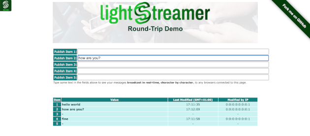

# Lightstreamer - Round-Trip Demo - HTML Client

<!-- START DESCRIPTION lightstreamer-example-roundtrip-client-javascript -->

This project includes a simple web client front-end example for the [Lightstreamer - Round-Trip Demo - Java Adapter](https://github.com/Lightstreamer/Lightstreamer-example-RoundTrip-adapter-java).

## Live Demo

[](http://demos.lightstreamer.com/RoundTripDemo)<br>
### [ View live demo](http://demos.lightstreamer.com/RoundTripDemo)

## Details

The *Round-Trip Demo* uses the <b>JavaScript Client API for Lightstreamer</b> to let you broadcast messages as you type, character by character, to all the browsers displaying that page. Type anything in the 5 fields. Your characters will be delivered to the server, which will send them back to all the browsers, including yours (in the bottom grid). Launch multiple instances of the demo, possibly on different browsers or different machines, to really appreciate the broadcast capabilities. 
You will type some text in a browser and see it appear in real-time on another browser.<br>

The grid to the bottom reports the originating IP address and the timestamp of the last change applied to each item.<br>

<i>Note: When you publish a value, your IP address is publicly displayed.</i>

The demo includes the following client-side functionalities:
* A [Subscription](http://www.lightstreamer.com/docs/client_javascript_uni_api/Subscription.html) containing 5 items, subscribed to in <b>MERGE</b> mode feeding a [StaticGrid](http://www.lightstreamer.com/docs/client_javascript_uni_api/StaticGrid.html).
* The messages are sent to the Lightstreamer Server using the [LightstreamerClient.sendMessage](http://www.lightstreamer.com/docs/client_javascript_uni_api/LightstreamerClient.html#sendMessage) utility.

<!-- END DESCRIPTION lightstreamer-example-roundtrip-client-javascript -->

## Install

If you want to install a version of this demo pointing to your local Lightstreamer Server, follow these steps:

* Note that, as prerequisite, the [Lightstreamer - Round-Trip Demo - Java Adapter](https://github.com/Lightstreamer/Lightstreamer-example-RoundTrip-adapter-java) has to be deployed on your local Lightstreamer Server instance. Please check out that project and follow the installation instructions provided with it.
* Launch Lightstreamer Server.
* Get the `lightstreamer.js` file from the [Lightstreamer 5 Colosseo distribution](http://www.lightstreamer.com/download) and put it in the `src/js` folder of the demo (if that is the case, please create it). Alternatively, you can build a `lightstreamer.js` file from the 
  [online generator](http://www.lightstreamer.com/docs/client_javascript_tools/generator.html).
  In that case, be sure to include the LightstreamerClient, Subscription, StaticGrid, ConnectionSharing, and StatusWidget modules and to use the "Use AMD" version.
* Get the `require.js` file form [requirejs.org](http://requirejs.org/docs/download.html) and put it in the `src/js` folder of the demo.


You can deploy this demo to use the Lightstreamer server as Web server or in any external Web Server you are running. 
If you choose the former case, please create the folders `<LS_HOME>/pages/demos/RoundTripDemo` then copy here the contents of the `src` folder of this project.<br>
The client demo configuration assumes that Lightstreamer Server, Lightstreamer Adapters, and this client are launched on the same machine. If you need to target a different Lightstreamer server, please search this line:
```js
var lsClient = new LightstreamerClient(protocolToUse+"//localhost:"+portToUse,"ROUNDTRIPDEMO");
```
in `js/lsClient.js` file and change it accordingly.<br>

The demo is now ready to be launched.

## See Also

### Lightstreamer Adapters Needed by This Demo Client

<!-- START RELATED_ENTRIES -->
* [Lightstreamer - Round-Trip Demo - Java Adapter](https://github.com/Lightstreamer/Lightstreamer-example-RoundTrip-adapter-java)

<!-- END RELATED_ENTRIES -->
### Related Projects

* [Lightstreamer - Basic Chat Demo - HTML Client](https://github.com/Lightstreamer/Lightstreamer-example-Chat-client-javascript)
* [Lightstreamer - Basic Messenger Demo - HTML Client](https://github.com/Lightstreamer/Lightstreamer-example-Messenger-client-javascript)

## Lightstreamer Compatibility Notes

* Compatible with Lightstreamer JavaScript Client library version 6.0 or newer.
